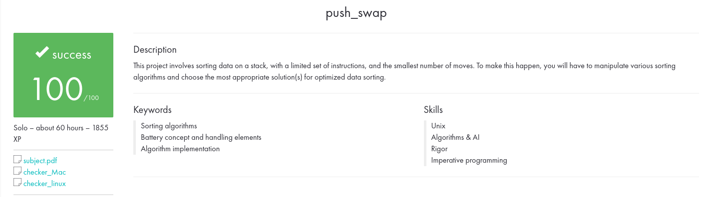

# PUSH_SWAP

<p align="center">
  <a href="">
    
  </a>
</p>

# Table of Contents
- [Table of Contents](#table-of-contents)
- [0. Description](#0-description)
- [1. Requirements](#1-requirements)
- [2. How to execute the program](#2-How-to-execute-the-program)
- [3. Running Makefile](#3-running-makefile)
- [4. Visualizer](#4-visualizer)

# 0. Description 

This project will make you sort data on a stack, with a limited set of instructions, using the lowest possible number of actions. 

You have at your disposal a set of integer values, 2 stacks, and a set of instructions to manipulate both stacks.

# 1. Requirements

• You have 2 stacks named **a** and **b**. The stack a contains a random amount of negative and/or positive numbers which cannot be duplicated. The stack b is empty.

• Operations at your disposal:

-> **sa (swap a)**: Swap the first 2 elements at the top of stack a.

-> **sb (swap a)**: Swap the first 2 elements at the top of stack b.

-> **ss**: **sa** and **sb** at the same time.

-> **pa (push a)**: Take the first element at the top of b and put it at the top of a.

-> **pb (push b)**: Take the first element at the top of a and put it at the top of b.

-> **ra (rotate a)**: Shift up all elements of stack a by 1. The first element becomes the last one.

-> **rb (rotate b)**: Shift up all elements of stack b by 1. The first element becomes the last one.

-> **rr**: **ra** and **rb** at the same time.

-> **rra (reverse rotate a)**: Shift down all elements of stack a by 1. The last element becomes the first one.

-> **rrb (reverse rotate b)**: Shift down all elements of stack b by 1. The last element becomes the first one.

-> **rrr**: **rra** and **rrb** at the same time.


# 2. How to execute the program


```sh
# Sample of commands
$> ./push_swap 2 1 3 6 5 8
```


# 3. Running Makefile

```sh

# Will generate a executable
$> make all

# Execute valgrind. Will check memory leaks
$> make leak

# will run norminette 
$> make norma

```

# 4. Visualizer

<p align="center">
  <a href="">
    
  </a>
</p>

